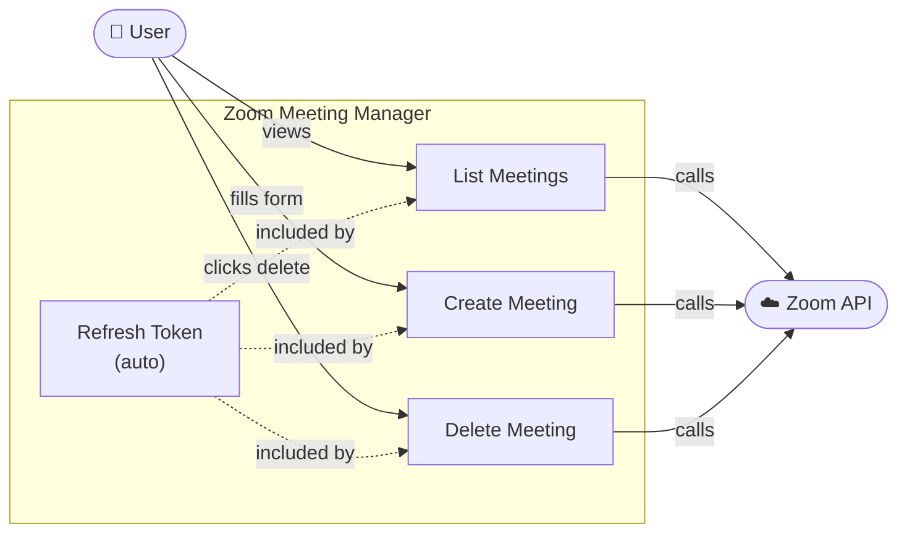
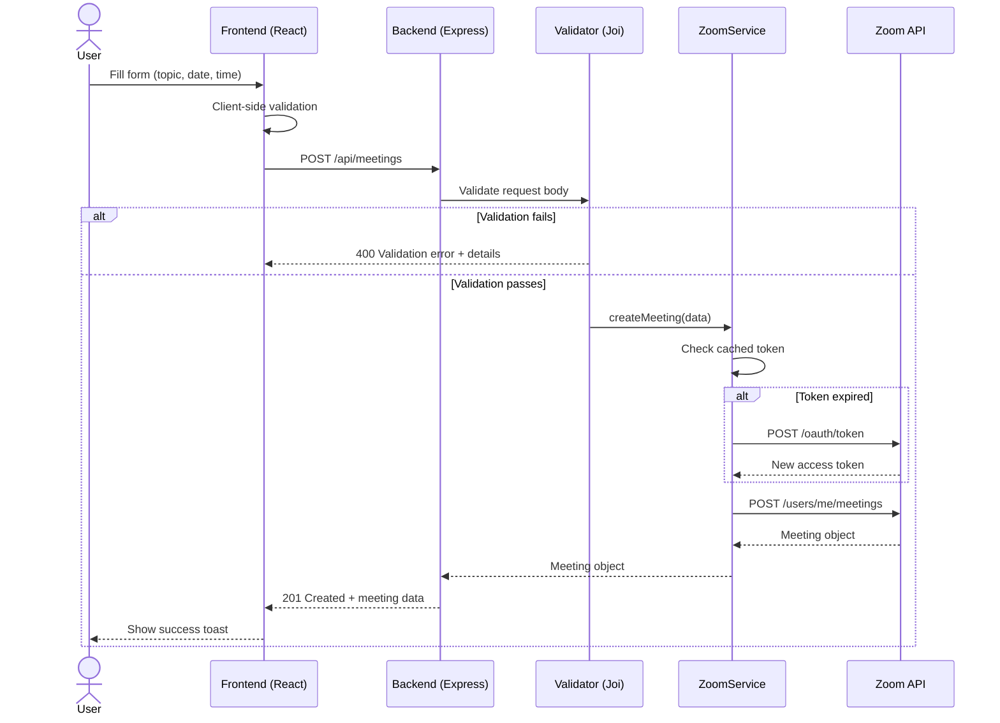
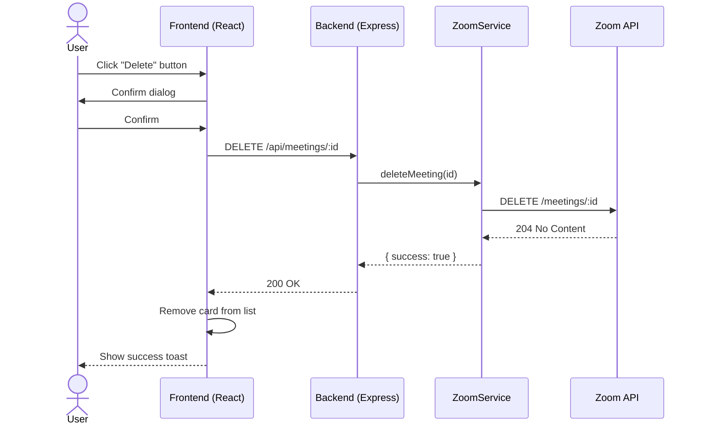
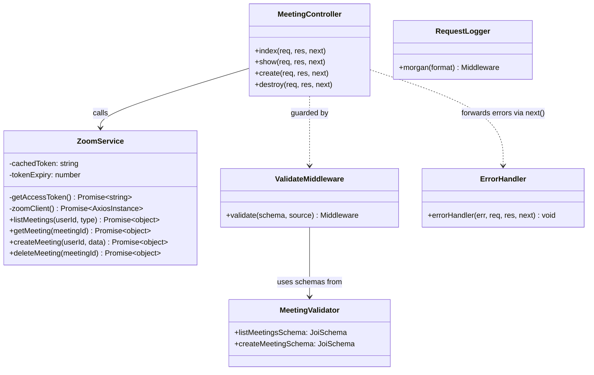

# Zoom Meeting Manager


A full-stack web application to **list**, **create**, and **delete** Zoom meetings using the Zoom REST API (Server-to-Server OAuth).

---

## Tech Stack

| Layer    | Technology                      |
|----------|---------------------------------|
| Backend  | Node.js · Express               |
| Frontend | React 18 (Create React App)     |
| Auth     | Zoom Server-to-Server OAuth 2.0 |

---

## Project Structure

```
zoom-meeting-manager/
├── backend/
│   ├── config/
│   │   └── index.js           # Env validation & config object
│   ├── controllers/
│   │   └── meetingController.js  # Route handlers
│   ├── middleware/
│   │   ├── errorHandler.js    # Global error handler
│   │   ├── requestLogger.js   # Morgan HTTP logger
│   │   └── validate.js        # Joi validation middleware factory
│   ├── routes/
│   │   └── meetingRoutes.js   # Express router
│   ├── services/
│   │   └── zoomService.js     # Zoom API client + token cache
│   ├── validators/
│   │   └── meetingValidator.js  # Joi schemas
│   ├── .env.example
│   ├── package.json
│   └── server.js              # App entry point
├── frontend/
│   ├── public/index.html
│   ├── src/
│   │   ├── index.js
│   │   └── App.js             # Full React UI
│   └── package.json
├── package.json               # Root scripts (concurrently)
└── README.md
```

---

## Prerequisites

- **Node.js** v18 or later
- A **Zoom account** (free tier works)
- A **Zoom Server-to-Server OAuth app** (see below)

---

## Step 1 — Create a Zoom Server-to-Server OAuth App

1. Go to [https://marketplace.zoom.us/develop/create](https://marketplace.zoom.us/develop/create)
2. Choose **Server-to-Server OAuth** → click **Create**
3. Give it any name (e.g. `Meeting Manager`)
4. From the **App Credentials** tab, copy:
   - **Account ID**
   - **Client ID**
   - **Client Secret**
5. In the **Scopes** tab, add these scopes:
   - `meeting:read:list_meetings:admin`
   - `meeting:write:meeting:admin`
   - `meeting:delete:meeting:admin`
6. Click **Activate** your app

---

## Step 2 — Configure Environment Variables

```bash
cd backend
cp .env.example .env
```

Edit `backend/.env`:

```env
ZOOM_ACCOUNT_ID=your_account_id_here
ZOOM_CLIENT_ID=your_client_id_here
ZOOM_CLIENT_SECRET=your_client_secret_here
PORT=3001
```

---

## Step 3 — Install Dependencies

```bash
npm run install:all
```

Or individually:

```bash
npm install                    # Root (concurrently)
npm install --prefix backend   # Express, axios, joi, morgan, etc.
npm install --prefix frontend  # React
```

---

## Step 4 — Run the Application

### Option A — Both servers together (recommended)

```bash
npm run dev
```

- Backend → **http://localhost:3001**
- Frontend → **http://localhost:3000**

### Option B — Separately

```bash
# Terminal 1
npm start --prefix backend

# Terminal 2
npm start --prefix frontend
```

Open **http://localhost:3000** in your browser.

---

## API Endpoints

| Method | Path                  | Description              |
|--------|-----------------------|--------------------------|
| GET    | `/api/health`         | Health check             |
| GET    | `/api/meetings`       | List meetings (`?type=scheduled\|upcoming\|live`) |
| GET    | `/api/meetings/:id`   | Get a single meeting     |
| POST   | `/api/meetings`       | Create a meeting         |
| DELETE | `/api/meetings/:id`   | Delete a meeting         |

### POST `/api/meetings` — Request Body

```json
{
  "topic": "Team Standup",
  "date": "2025-06-01",
  "time": "10:00",
  "duration": 60,
  "timezone": "Asia/Riyadh"
}
```

### Validation Rules

| Field      | Rule                                  |
|------------|---------------------------------------|
| `topic`    | Required, 1–200 characters            |
| `date`     | Required, format `YYYY-MM-DD`         |
| `time`     | Required, format `HH:MM`              |
| `duration` | Optional, 15–300 minutes (default 60) |
| `timezone` | Optional, IANA tz string (default UTC)|

---

## Architecture

### Layered Architecture (Clean Code)

```
Request
  │
  ▼
[ requestLogger ]   ← Morgan: logs every HTTP request
  │
  ▼
[ validate ]        ← Joi: validates & sanitises input
  │
  ▼
[ Controller ]      ← Thin handler: calls service, returns response
  │
  ▼
[ ZoomService ]     ← Zoom API calls + OAuth token caching
  │
  ▼
[ errorHandler ]    ← Catches any error, returns uniform JSON
```

---

## UML Diagrams

### Use Case Diagram



---

### Sequence Diagram — Create Meeting



---

### Sequence Diagram — Delete Meeting



---

### Class Diagram



---

## Features

- **List Meetings** — View all scheduled meetings with topic, date/time, duration, and status badge (Past / Soon / Upcoming)
- **Create Meeting** — Form with topic, date, time, duration, and timezone
- **Delete Meeting** — Delete any meeting with a confirmation prompt
- **Validation** — All inputs validated server-side with Joi (400 + error details on failure)
- **Logging** — Every HTTP request logged via Morgan
- **Token caching** — OAuth tokens reused until 60 s before expiry
- **Global error handler** — Uniform JSON error responses

---

## Troubleshooting

| Problem | Fix |
|---------|-----|
| `Missing required environment variables` | Check that `backend/.env` exists with all three Zoom values |
| `401 Unauthorized` from Zoom | Verify Client ID & Secret; make sure the app is **Activated** |
| `403 Forbidden` / missing scopes | Add required scopes in Zoom Marketplace and reactivate |
| Frontend can't reach backend | Ensure backend is on port 3001; the React proxy is pre-configured |
| Meetings not appearing | Zoom may return an empty list for new accounts — create one first |
